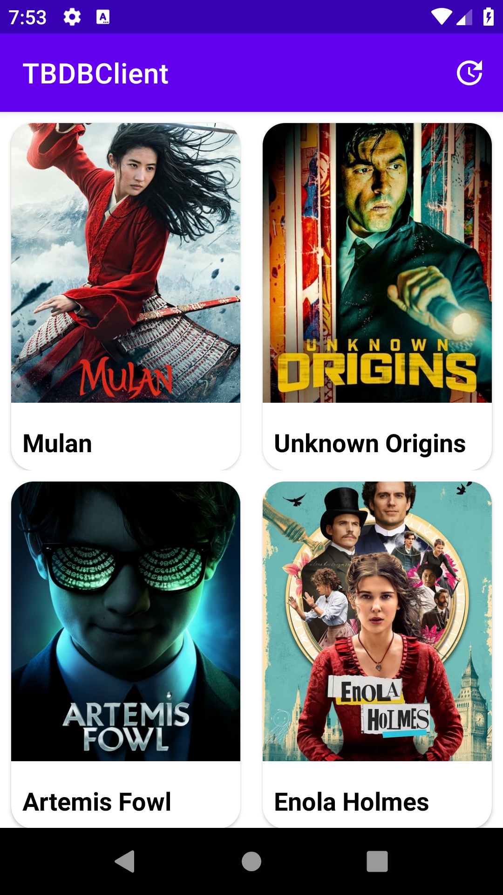
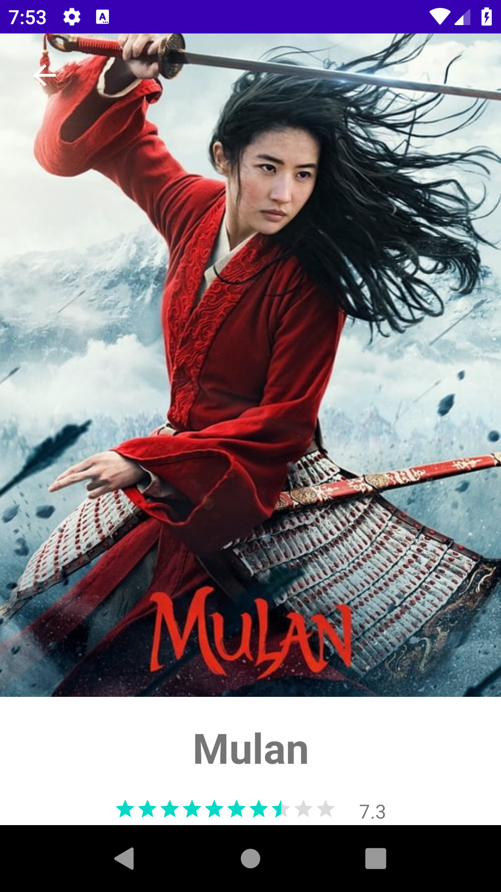
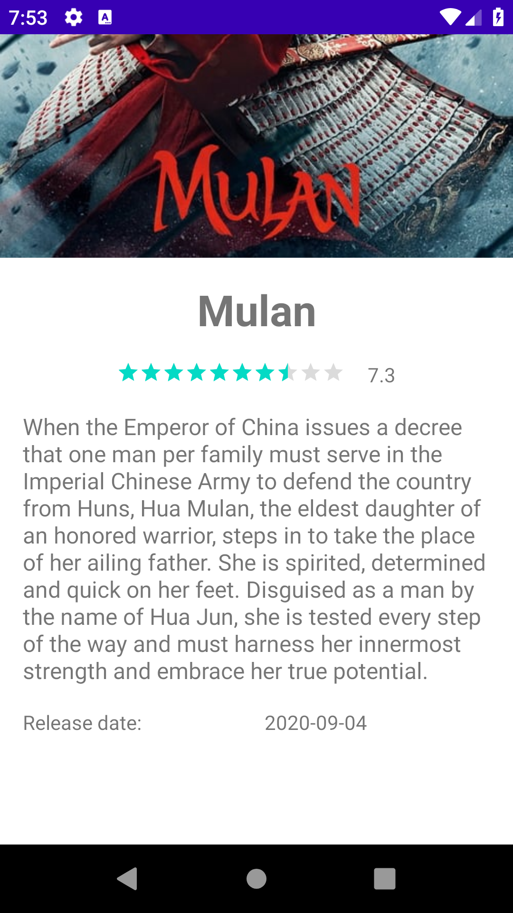

# TMDB CLIENT

### TMDB Client es una app básica de visualización de películas populares.

Esta app esta desarrollada con Kotlin usando clean architecture MVVM, Retrofit, Coroutines, Dagger injection y Room persistence

